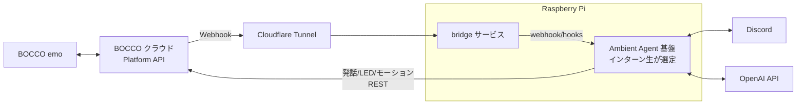

# BOCCO emo × Ambient Agent 開発インターン onepager

**Status**: Draft | **最終更新**: 2026-07-31

## 背景

実働 5 日間のサマーインターン課題。会話ロボット BOCCO emo の Platform API と Discord を組み合わせて、Ambient Agent (チャットへの応答だけでなく、話しかけ・センサー等の環境イベントに自発的に反応して動く agent) を開発する。成果は会社ブログで発信する。

## Goals

- 成果を会社ブログで公開し、BOCCO emo とユカイ工学に興味を持ってもらう (最終ゴール)
- インターン生が coding agent と伴走して、計画 → 設計 (design doc / ADR) → 実装 → 検証 → 発信の開発サイクルを 1 周体験する
- BOCCO emo と Discord の両方から呼び出せる Ambient Agent のデモを動かす

## Non-Goals

- **本番運用品質** (冗長化・監視・本番水準のセキュリティ): 5 日間のプロトタイプに集中する
- **複数ユーザー / 複数 emo 対応**: デモは 1 ユーザー・1 台で成立させる
- **LLM の学習・ファインチューニング**: 既成の API をそのまま使う
- **BOCCO emo 製品機能の置き換え・変更**: Platform API の外側から拡張するデモに限る

## 成果物 (納品物)

1. 動くデモ (Raspberry Pi 上で動く Ambient Agent。BOCCO emo と Discord の両方から呼び出せる)
2. ソースコード (GitHub public repo **`bocco-emo-ambient-agent-demo`** で最初から公開開発する。bridge サービス・agent 基盤の設定/skill・README を含む)
   - public 前提のため、**機密・実環境の識別子をコードにも commit 履歴にも入れない**こと (`.env` + `.gitignore` を徹底)
3. 設計ドキュメント (design doc + ADR。agent 基盤の選定理由などの意思決定を記録する)
4. デモ動画・構成図 (ブログ素材)
5. ブログ記事ドラフト + 成果発表 (Day 5)

## 作るもの

「Raspberry Pi 上で常時動く Ambient Agent。BOCCO emo (音声) と Discord (テキスト) のどちらからでも呼び出せ、環境イベントには自発的に反応する」

必須デモシナリオ (ブログの見せ場):

1. **音声対話**: emo に話しかける → agent が応答を生成 → emo が喋る (TTS)
2. **テキスト⇄音声の横断**: Discord で agent と会話し、「emo に伝えて」で emo が発話する
3. **Ambient な自発行動**: センサーイベント (例: `radar.detected` = 人の接近) を契機に、agent が挨拶を発話し Discord に通知する

## システム構成



- BOCCO emo からのイベント (話しかけ・センサー) は Platform API の Webhook → Cloudflare Tunnel → Pi 上の bridge → agent 基盤の webhook 受け口に流す
- agent から emo への出力 (発話・LED・モーション) は Platform API の REST を叩く tool/skill として agent 基盤に持たせる
- Discord は agent 基盤の内蔵チャネルをそのまま使う。bot のコードは書かないが、Discord Developer Portal での bot application (トークン) 発行は必要。候補 2 基盤とも Discord 対応だが実機検証はまだのため、Day 3 冒頭に疎通を最優先で確認する

## 技術選定

**必須条件: 採用するツール・サービスはすべて商用利用可能であること** (インターン生が追加で選ぶものも同様。OSS は MIT / Apache-2.0 / BSD 等の permissive license を推奨)。使用予定分の確認結果は後述「ライセンス / 商用利用の確認結果」参照。

### メンター側で決定済み

| 項目 | 採用 | 理由 |
|---|---|---|
| LLM | OpenAI API (会社支給キー) | 候補の agent 基盤はいずれも公式対応 |
| coding agent | 自由 (インターン生が選ぶ) | 種類は限定しない。支給する OpenAI API キーで動くもの (例: Codex CLI) は用意できる |
| 実行環境 | Raspberry Pi 5 (64bit) | 手元で完結する常時稼働マシン。イメージは下記「Raspberry Pi 環境構築方式」で作る (Node.js LTS 同梱済み) |
| Webhook 公開 | Cloudflare Quick Tunnel (`cloudflared tunnel --url http://localhost:<port>`) | ポート開放・ドメイン・アカウント一切不要で HTTPS URL が発行される。URL は起動ごとに変わるため、bridge 起動時に `PUT /v1/webhook` で現在の URL を自動登録する。手順は [raspberry-img/README.md](raspberry-img/README.md) |
| Discord 連携 | agent 基盤の内蔵 Discord チャネル | 候補はいずれも Discord 公式対応。設定のみで済ませ、時間を BOCCO emo 連携に使う |
| BOCCO emo 連携 | 自作 bridge + agent 基盤の tool/skill | 最短で動く形。チャネル plugin 化はストレッチ |
| ソースコード管理 | GitHub public repo (`bocco-emo-ambient-agent-demo`) | 最初から公開開発。CI (GitHub Actions) は public repo なら無料で無制限。秘密情報 (トークン類) はコミットしない (`.env` + `.gitignore`) |

### Raspberry Pi 環境構築方式 (社内で実績のある方式)

設定済みのカスタム OS イメージをビルドして SD カードに焼く。**ビルド一式 (Dockerfile・layer 定義・cloud-init テンプレート・スクリプト) はこの repo の [`raspberry-img/`](raspberry-img/README.md) に同封済み**:

| 要素 | 選定 |
|---|---|
| イメージ生成 | [rpi-image-gen](https://github.com/raspberrypi/rpi-image-gen) v2.1.0 (Raspberry Pi 公式。宣言的 YAML レイヤー + mmdebstrap) を Docker コンテナ内で実行 |
| ベース OS | Debian Bookworm (arm64) + Raspberry Pi 公式 apt アーカイブ。本プロジェクトはヘッドレスで足りるため desktop レイヤーは外して最小構成にする |
| ビルド実行環境 | macOS (Apple Silicon) + Docker Desktop。`scripts/build.sh` 一発実行 (apt-cacher-ng キャッシュ付き) |
| 静的設定 | rootfs-overlay (静的ファイル) + customize-hooks (SSH 有効化・ロケール/TZ・apt 由来 unit の有効化)。overlay のコピーは customize-hooks より後に走るため、置いたファイルを加工・有効化する処理は cleanup-hooks に書く |
| 個体設定・機密の注入 | cloud-init (NoCloud)。Wi-Fi は NetworkManager の `.nmconnection` を、API キー等は 0600 のファイルを `user-data` の `write_files` で配置し、`scripts/inject-cloud-init.sh` で .img の boot パーティションに書き込む ([ADR 0001](docs/adr/0001-raspberry-pi-image.md)) |
| SD 書き込み | macOS の `diskutil` + `dd` (SD 検出補助スクリプトあり) |

ビルドの流れ:

1. プロジェクト設定 (`image.yaml`) に device layer (`rpi5`)・image layer (`image-rpios`)・パーティションサイズ・独自 layer を宣言する
2. 独自 layer (YAML) に、入れる apt パッケージ・customize-hooks (SSH 有効化・apt 由来 unit の有効化等)・rootfs-overlay (静的ファイルのコピー)・cleanup-hooks (overlay 配置後の加工) を書く
3. Docker コンテナ (debian:bookworm、`privileged` 必須) 内で `rpi-image-gen build` を実行して `.img` を得る。Apple Silicon なら arm64 ネイティブでビルドできる (amd64 ホストは qemu + binfmt が必要)。apt-cacher-ng をサイドカーにするとリビルドが速い
4. cloud-init の `user-data` / `network-config` (機密入り) を boot パーティション (FAT32) に置く。SD に焼いた後、Mac でマウントしてコピーするのが簡単 (FAT32 なので macOS から書ける)
5. `diskutil unmountDisk` → `dd` で SD カードに書き込み、Pi を起動して SSH 接続を確認する

注意点:

- device layer は `rpi5` を使う (別モデルにする場合は layer 変更が必要)
- Node.js (LTS) と Python はイメージに同梱済み。他に必要なランタイムがあればレイヤーの package list に追加する ([ADR 0002](docs/adr/0002-nodejs-version-policy.md))
- 機密は初回起動後も boot パーティションに**平文で残る**。機材の返却・貸与時の削除手順は [raspberry-img/README.md](raspberry-img/README.md)
- 機密ファイル (`cloud-init/user-data` 等) は `.gitignore` してテンプレートのみコミットする

### インターン生が選定するもの (Day 1 に決めて ADR に理由を記録)

**Ambient Agent 基盤**。事前調査済みの候補は以下の 2 つ (これ以外を提案してもよい):

| 観点 | [OpenClaw](https://github.com/openclaw/openclaw) | [hermes-agent](https://github.com/NousResearch/hermes-agent) |
|---|---|---|
| ランタイム | Node.js 単系統 | Python 3.11 + Node.js + ffmpeg |
| Raspberry Pi | 公式インストールガイドあり ([docs](https://docs.openclaw.ai/install/raspberry-pi)) | コミュニティ実績 (ARM64 Docker) |
| Discord | 内蔵チャネル | 内蔵ゲートウェイ |
| Webhook 受信 | `/hooks/` (Bearer トークン認証) | HMAC 検証 + payload→prompt 変換 ([docs](https://hermes-agent.nousresearch.com/docs/user-guide/messaging/webhooks)) |
| 拡張機構 | Skills + Plugin SDK (チャネル追加可) | Skills (自動生成・改善) + MCP |
| ライセンス | MIT | MIT |

選定の必須条件: **商用利用可能なライセンスであること** (候補 2 つはともに MIT で確認済み。別の基盤を提案する場合はライセンス確認を選定に含める)

選定観点の例: Raspberry Pi で安定して動くか / emo 連携 (webhook 受け口・tool 追加) の作りやすさ / ドキュメントの充実度 / 自分が触っていて楽しいか

OpenClaw を触ったときのメモ (選定の参考に。採用したら自分の README へ移すこと):

- `openclaw agent --local` は 1 回きりの実行。`cron` (自己スケジューリング) や `commitments` のような
  状態を持つ機能は **Gateway (常駐デーモン)** 経由でないと使えない (`openclaw daemon install`)
- Gateway の agent は環境変数ではなく専用の auth store を見るため、`OPENAI_API_KEY` を
  渡すだけでは動かない。`openclaw onboard` で認証を設定する
- `--json` 出力の応答本文は `meta.finalAssistantVisibleText`
- `web_fetch` / `browser` / `exec` 等のツールを持つので、ネット上の最新情報も扱える

bridge サービスの実装言語も、選んだ agent 基盤に合わせてインターン生が決める (Node.js/TypeScript または Python を推奨)。

### ライセンス / 商用利用の確認結果

| 対象 | ライセンス / 条件 | 商用利用 |
|---|---|---|
| OpenClaw / hermes-agent | MIT | 可 |
| rpi-image-gen | BSD-3-Clause | 可 |
| cloud-init / mmdebstrap / apt-cacher-ng | GPL-3.0・Apache-2.0 dual / MIT / BSD | 可 (ツールとして使うだけなら義務なし) |
| Raspberry Pi OS・公式パッケージ ([licensing](https://www.raspberrypi.com/licensing/)) | BSD-3-Clause 中心 + non-free-firmware | 可 (OS イメージを社外へ再配布する場合のみ GPL のソース提供通知が必要) |
| cloudflared | Apache-2.0 | 可 |
| Cloudflare Quick Tunnel ([docs](https://developers.cloudflare.com/cloudflare-one/connections/connect-networks/do-more-with-tunnels/trycloudflare/)) | testing and development only (SLA なし・同時 200 リクエスト上限) | 開発・デモ用途は可。**恒常運用に移す場合は named tunnel (要アカウント + ドメイン) へ移行** |
| Docker Desktop ([license](https://docs.docker.com/subscription/desktop-license/)) | 従業員 250 人未満かつ年商 $10M 未満の企業は無料 | 可 (しきい値超過時は有償サブスクリプション) |
| OpenAI API ([Business Terms](https://openai.com/policies/business-terms/)) / Codex CLI (Apache-2.0) | Output は利用者所有 | 可 |
| Discord API ([Developer ToS](https://support-dev.discord.com/hc/en-us/articles/8562894815383-Discord-Developer-Terms-of-Service)) | 企業による bot 開発・運用を許可 | 可 (API データの販売・第三者提供は不可) |

## BOCCO emo Platform API 要点

API リファレンス: [https://platform-api.bocco.me/api-docs/](https://platform-api.bocco.me/api-docs/)

- **認証**: ダッシュボード ([https://platform-api.bocco.me/dashboard/login](https://platform-api.bocco.me/dashboard/login)) で access_token / refresh_token を取得。access_token の有効期限は **1 時間** → refresh 処理を最初に組む。**refresh token はローテーションする** (refresh すると新しい refresh token が返り、古い方は無効になる) ので、返ってきた値を保存し損ねるとダッシュボードで取り直しになる (Python SDK は自動 refresh 実装済みで参考になる: [https://github.com/YUKAI/emo-platform-api-python](https://github.com/YUKAI/emo-platform-api-python))
- **発話**: `POST /v1/rooms/{room_uuid}/messages/text` でテキストを送ると emo が読み上げる。LED (`motions/led_color`)・首振り (`motions/move_to`)・プリセットモーションも REST で叩ける
- **Webhook**: 登録できる URL は **1 つだけ**。`X-Platform-API-Secret` ヘッダで送信元検証、`request_id` で重複排除。主なイベント: `message.received` (話しかけ音声。`audio_url` 付き)・`trigger_word.detected`・`radar.detected` (人感)・`illuminance.changed`・`motion.finished` など。利用できるのは **Personal / Business Advanced プランのみ** (Business Basic は Webhook API が 401)
- **Webhook の配送特性**:
  - 配送は概ね即時 (実機で話しかけてから受信まで **1 秒**)。ただし**送信失敗時のリトライは無い**ため、取りこぼしうる前提で設計する
  - **Platform API から自分が投稿したメッセージも `message.received` として返ってくる**。payload の `user.uuid` で自分の投稿を除外しないと、agent が自分の発話に反応し続ける無限ループになる
- **レートリミット**: **20 回/分** (超過で 429、Personal プラン) → 会話ループでの連打に注意
- **開発者モード**: スマホアプリの設定から有効化するとボタン押下イベント等が取れる (通常の VUI 反応は一部無効化される): [https://note.com/ux_xu/n/n94196358dfa9](https://note.com/ux_xu/n/n94196358dfa9)

### 話しかけ内容のテキスト化 (STT)

**`message.received` の payload `message.ja` には音声認識テキストが常に入る** (音声メッセージの保存時にサーバー側で音声認識が実行される。プランやアプリの「こえ文字メール」設定に依存しない)。実装はこのテキストをそのまま使えばよい。

実機で確認済み — emo に話しかけると以下が届く:

```json
{ "event": "message.received",
  "data": { "message": {
    "user": { "user_type": "emo", "nickname": "..." },
    "message": { "ja": "今日はいい天気ですね。" },
    "media": "audio",
    "audio_url": "https://platform-api.bocco.me/ext/1/rooms/.../feeds/.../audio",
    "lang": "ja" } } }
```

注意点:

- STT が失敗した場合、`message.ja` は**空文字**、または**「（文字起こしできませんでした。音声を聴いて直接ご確認ください）」というプレースホルダ文字列**になる → bridge 側で両方を弾き、「聞き返す」等のフォールバックにする
- 生の音声が必要な演出をする場合は `audio_url` から取得できる (Platform API の Bearer トークンが必要)

## 5 日間マイルストーン

| Day | やること | Done 条件 |
|---|---|---|
| **1** | **把握・計画 + 基盤準備**: この onepager と各ドキュメントを読み込み、coding agent と一緒に設計・タスク分解。agent 基盤を選定して ADR に記録、design doc を作成。環境準備 (Pi・API キー・Discord) も開始 | 計画 (Day 2〜5 タスクリスト) + design doc / ADR をメンターがレビューして確定 |
| **2** | **基盤準備の続き + 開発着手**: Pi 環境構築の完了 (イメージビルド → SD 焼き込み → 起動確認)、BOCCO emo API 疎通 (トークン取得と refresh、emo の発話、Tunnel 経由の Webhook 受信と `message.ja` の STT テキスト確認) | 「話しかけ → テキスト取得 → emo が返事する」の一往復が通る |
| **3** | **本格的な開発**: agent 基盤のセットアップ、Discord チャネル接続、emo 発話 tool/skill 実装、bridge → agent 連携 | Discord で agent と会話でき、agent が emo を喋らせられる |
| **4** | **本格的な開発 + 最終調整**: 必須デモシナリオ 1〜3 を通し、デモ動画を撮影。余裕があればストレッチへ | デモシナリオ 3 本が録画済み |
| **5** | **最終調整の続き + ブログ記事執筆 + 発表**: 構成図・動画・つまずきポイントを記事化し、成果を発表する | 記事ドラフトがレビュー可能な状態 + 発表完了 |

### ストレッチゴール (Day 4 に余裕があれば)

- BOCCO emo を agent 基盤のチャネル plugin として実装し、Discord と同列の会話面にする (例: OpenClaw の [Plugin SDK](https://docs.openclaw.ai/tools/plugin))
- 照度センサー (`illuminance.changed`) の変化を契機に「おはよう + 今日の予定を Discord に投稿」
- emo の感情表現 (LED 色・モーション) を応答内容に連動させる

## リスクと対策

| リスク | 対策 |
|---|---|
| Webhook の取りこぼし (配送失敗時のリトライが無い) | 反応が無いときに emo 側から催促できる導線を用意する。デモは 1 発勝負にしない |
| 自分の投稿へのエコーで無限ループ | `message.received` の `user.uuid` で自分の投稿を除外する処理を bridge の最初に実装する |
| STT が空文字 / 失敗プレースホルダを返す | 両ケースを弾いて emo に聞き返させる等のフォールバックを入れる |
| レートリミット 20 回/分 | 応答は 1 発話にまとめる。429 時は指数バックオフ |
| Webhook URL が 1 つしか登録できない + Quick Tunnel の URL が起動ごとに変わる | bridge 起動時に `PUT /v1/webhook` で現在の Tunnel URL を自動登録する (検証も本番も同じ受け口を通し、bridge 側で分岐する) |
| access_token 失効 (1h) | 401 → refresh → リトライを bridge の HTTP クライアントに最初から組み込む |
| agent 基盤の公開面 (webhook/hooks) への不正アクセス | 受け口は認証必須 (Bearer トークン等) にし、Tunnel 経由の bridge からのみ叩く。Discord は自分のサーバー限定。参考 (設定不備による漏洩事例): [https://blog.gitguardian.com/moltbot-personal-assistant-goes-viral-and-so-do-your-secrets/](https://blog.gitguardian.com/moltbot-personal-assistant-goes-viral-and-so-do-your-secrets/) |
| Pi の環境差 | rpi-image-gen の宣言的ビルドで再現可能にする。Node.js LTS は同梱済みなので、他に必要なランタイムがあれば Day 1 に確認してレイヤーの package list に反映する |
| Pi が見つからない (mDNS が不安定) | `ambient-pi.local` が解決しないことがある。ARP かルーターの DHCP 一覧から IP を直接見つける (手順は [raspberry-img/README.md](raspberry-img/README.md)) |

## 事前準備 (メンター側チェックリスト)

- [ ] BOCCO emo 実機 (Wi-Fi モデル) + BOCCO アカウント + 部屋作成
- [ ] Platform API ダッシュボードでトークン取得できることを確認
- [ ] Platform API アカウントのプラン確認 (Webhook を使えるのは Personal / Business Advanced のみ。Business Basic は不可)
- [ ] OpenAI API キー発行 (agent 用 + Codex CLI 用)
- [ ] Discord サーバー作成 + Bot application 発行
- [ ] Raspberry Pi 5 + SD カード (32GB 以上) + macOS/Docker Desktop のビルド環境
- [ ] GitHub public repo `bocco-emo-ambient-agent-demo` の作成 (LICENSE 追加、raspberry-img 一式とこの onepager の移植)

## 参考リンク

- リポジトリの入口と設計判断 (ADR) の一覧: [README.md](README.md)
- イメージのビルドと Pi の運用: [raspberry-img/README.md](raspberry-img/README.md)

- BOCCO emo: [https://www.bocco.me/](https://www.bocco.me/)
- Platform API リファレンス: [https://platform-api.bocco.me/api-docs/](https://platform-api.bocco.me/api-docs/)
- 法人向け BOCCO emo APIs: [https://biz.ux-xu.com/platform-api](https://biz.ux-xu.com/platform-api)
- OpenClaw: [https://github.com/openclaw/openclaw](https://github.com/openclaw/openclaw) / docs: [https://docs.openclaw.ai/](https://docs.openclaw.ai/)
- hermes-agent: [https://github.com/NousResearch/hermes-agent](https://github.com/NousResearch/hermes-agent) / docs: [https://hermes-agent.nousresearch.com/docs/](https://hermes-agent.nousresearch.com/docs/)
- Discord Developer Platform: [https://discord.com/developers/docs](https://discord.com/developers/docs)
- Cloudflare Tunnel: [https://developers.cloudflare.com/cloudflare-one/connections/connect-networks/](https://developers.cloudflare.com/cloudflare-one/connections/connect-networks/)
- rpi-image-gen: [https://github.com/raspberrypi/rpi-image-gen](https://github.com/raspberrypi/rpi-image-gen)
- cloud-init NoCloud: [https://cloudinit.readthedocs.io/en/latest/reference/datasources/nocloud.html](https://cloudinit.readthedocs.io/en/latest/reference/datasources/nocloud.html)
- Ambient Agents (LangChain): [https://www.langchain.com/blog/introducing-ambient-agents](https://www.langchain.com/blog/introducing-ambient-agents)
