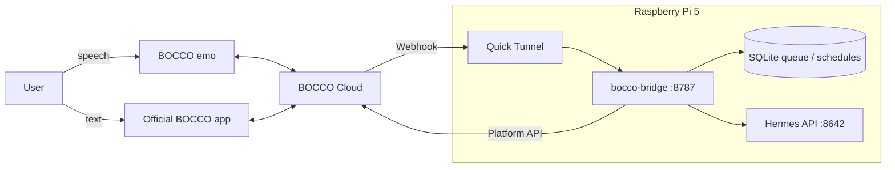

# 実装ステータス

このインターン課題の現在地を記録する。課題そのものの背景・目的・技術選定は
[../ONEPAGER.md](../ONEPAGER.md) が原本で、この文書はそれを置き換えない。

**Status**: Software complete; final hardware demo pending | **更新**: 2026-08-03

## Goal

Raspberry Pi 5 上で常時動く Ambient Agent を作り、BOCCO emo の音声と公式 BOCCO アプリの text の両方に
Hermes Agent が応答する。sensor event にも自発的に反応し、成果を demo、設計文書、blog draft として残す。

## Demo scenarios

1. **音声対話**: emo に話す → BOCCO Webhook → Hermes → emo が短く返事する
2. **アプリ対話**: 公式アプリに text を送る → 同じ room flow で Hermes reply → app history と emo 発話に反映
3. **Ambient behavior**: proximity、instant handling、morning/evening light change → precomputed persona bank から即座に話す
4. **Persona change**: アプリで `ペルソナ：<性格>` と送る → robot の性格が再起動後も切り替わる
5. **Proactive scheduler**: `予定：08:30 ブリーフィング` → 指定時刻に robot が自発的に朝の情報を話す
6. **Household memory**: `おぼえて：猫の名前はミケ` → 後日の関連する会話だけに部屋の記憶を反映する
7. **Motion choreography**: inline cue の位置に合わせて speech 中の gesture を最大 3 個 self-calibrated timing で送る
8. **Fast routes**: 明確な天気・時刻・ニュース質問は audited script + 1 Hermes call で短く答える
9. **Instant acknowledgment**: 通常の質問は生成を待つ間、短い nod motion で「聞こえた」を即座に示す

## Non-goals

- production-grade HA、監視、multi-tenant operation
- 複数 user / room / emo 対応
- LLM training/fine-tuning
- BOCCO product behavior の置き換え
- 独自 chat UI の開発

## Architecture



Only local services:

- `bocco-bridge.service`: Webhook、queue、BOCCO client、token store、radar、Quick Tunnel
- `hermes-api.service`: loopback-only Responses API と OpenAI provider

## Core behavior

- Webhook secret を body parsing 前に検証する
- normalized event を SQLite に保存してから `202` を返す
- `request_id` で duplicate を抑止する
- processing 中の crash は restart 後に再開する
- POST response と Webhook の `unique_id` を SQLite で照合して API message echo を除外する
- POST に ID がない場合だけ room + exact-text SHA-256 を 10 分 window で 1 回照合する
- access token 401 は refresh token rotation を保存して 1 回 retry する
- response と BOCCO delivery を checkpoint し、retry で robot speech を重複させない
- Quick Tunnel replacement ごとに current URL/secret を再登録する
- radar は morning/day/evening reaction bank から model call なしで選び、BOCCO delivery 後に cooldown を永続化して完了する
- radar の default cooldown は 30 分
- 音声向け基本ルールは固定し、optional nickname/persona を bridge 設定から Hermes instructions に追加する
- in-chat persona command は Hermes を呼ばず、500 文字 guard、queue checkpoint、通常の echo suppression を使う
- `のんびり`、`てれすけ`、`むかんしん` は BOCCO personality preset profile に展開する
- user message は pending radar/accel/schedule/bank refresh より先に claimし、user 同士の順序は維持する
- daily schedule と reaction-bank refresh は最低-priority generation lane へ入り、single worker で直列処理する
- `last_fired_date` で restart duplicate を防ぎ、停止中に過ぎた時刻は retroactive に発火しない
- explicit memory command は room-scoped FTS5 store を更新し、関連する active fact を persona 後へ bounded injection する
- accel は debounce せず最初の kind に即時反応する。同じ受信秒に queue 済みの kind だけ drama priority で 1 件にし、後続は cooldown で抑える
- startup/persona change で kind ごとの短文 bank を background refreshし、event-time model call はゼロ。dropped/upside-down は fixed caring tone
- light reaction は Pi-local morning/evening window と共通 8 時間 cooldown の外では無言にする
- inline motion cue は本文から除去し、startup catalog、durable chain、finish event、8 calls/min budget で best-effort 実行する
- normal Hermes path だけ motion-only `ALRIGHT_N_0` ack を fire-and-forget し、command/fast route/non-speech は skip する
- exact/short-place fast route は tool-selection model turns を省き、失敗・near miss・disabled route は normal Hermes path に戻す
- fast-route scripts は root-owned `/usr/local/share/bocco-bridge/fast-skills/` に installer が複製し、private Hermes home traversal を不要にする
- Hermes request は `max_output_tokens=128`、example compression threshold は 8000 tokens。bridge text は最終的に 200 文字へ制限する

## Decisions

- Pi image: rpi-image-gen + cloud-init ([ADR 0001](adr/0001-raspberry-pi-image.md))
- Node.js: official tarball、LTS series fixed ([ADR 0002](adr/0002-nodejs-version-policy.md))
- Agent: Hermes Agent ([ADR 0003](adr/0003-hermes-agent.md))
- Text interface: BOCCO official app ([ADR 0004](adr/0004-bocco-app-replaces-discord.md))

## Deliverables

1. emo speech、app text、radar の 3 demo flows と motion echo の silent handling
2. public source code with no real credential or identifier
3. design docs、ADR、test evidence
4. architecture image と demo video
5. blog draft と final presentation

## Milestones

| Day | Work | Done condition |
|---|---|---|
| 1 | project understanding、architecture、agent decision | ADR/design reviewed |
| 2 | Pi image、BOCCO token/send/Webhook | 1 BOCCO round trip |
| 3 | Hermes API、queue、integration | speech/app fake-server flow passes |
| 4 | live app/radar validation、demo capture | 3 scenarios recorded |
| 5 | hardening、blog、presentation | reviewable article and test evidence |

## Hardware validation

Confirmed with a redacted real-room capture:

- app text produces a usable `message.received`
- speech、app text、API echo は同じ account sender UUID を使う
- speech は `media=audio`、app/echo は `media=text` だが app と echo の shape は同じ
- Platform API motion echo は `media=motion` かつ text が null で、bridge は STT failure と誤認せず無言で完了する
- message identifier は `data.message.unique_id`

Remaining demo gate:

- Platform API reply appears in app history and emo speaks it
- radar behavior and cooldown look natural
- face tap、head pat、pickup がどの `accel.detected` kind/set になるかを user 立会いで characterization する
- text 直後の preset motion が speech と concurrent か、speech 後に queued かを 1 回測定して choreography default を確定する

Captured fixture は secret、token、real UUID、personal message、audio URL、Tunnel URL を redaction してから Git に入れる。

## Risks

| Risk | Mitigation |
|---|---|
| Webhook miss | demo を 1-shot にせず再送できる導線を用意 |
| Self-echo loop | durable `unique_id` correlation、ID-less response の one-shot hash fallback |
| STT empty/failure | `media=audio` のときだけ fixed short retry prompt。empty non-speech media は silent complete |
| 20 requests/minute | 1 response/turn、bounded backoff |
| Token rotation loss | new token pair を atomic 保存後に retry |
| Tunnel URL replacement | child supervision と automatic registration |
| App payload drift | redacted live fixture を parser regression test に使う |

## Verification

```sh
../scripts/test-bridge.sh
```

Software tests use fake local services only. Final acceptance requires emo speech、app input/output、radar を real Pi で各 1 回通す。

## References

- [BOCCO emo Platform API](https://platform-api.bocco.me/api-docs/)
- [BOCCO official app](https://www.bocco.me/application/)
- [Hermes Agent](https://hermes-agent.nousresearch.com/docs/)
- [Cloudflare Quick Tunnel](https://developers.cloudflare.com/cloudflare-one/connections/connect-networks/do-more-with-tunnels/trycloudflare/)
- [Bridge architecture](design/bridge-architecture.md)
- [Bridge runtime](design/bridge-runtime.md)
