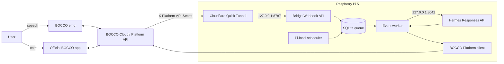

# BOCCO emo bridge architecture

- Status: Accepted for software testing
- Date: 2026-08-03
- Decision: [ADR 0004](../adr/0004-bocco-app-replaces-discord.md)

## Purpose

BOCCO emo の音声、公式アプリの text、sensor event を 1 つの BOCCO room flow で受け、Hermes Agent で
短い日本語応答を生成して BOCCO Platform API に返す。BOCCO 固有の security と reliability は bridge に
閉じ込め、Hermes は AI generation に限定する。

## Goals

- emo speech または app text への Hermes reply を emo と app room history に返す
- `radar.detected` で 1 回挨拶し、persistent cooldown で連続発話を抑える
- accel handling と radar に precomputed persona reaction を model call なしで即時返す
- Pi-local daily schedule で custom prompt または morning briefing を自発的に話す
- token rotation、self-echo、duplicate Webhook、restart、rate limit を安全に扱う
- Internet-facing surface を BOCCO Webhook 1 endpoint に限定する

## Non-goals

- 複数 user / room / robot の production service
- BOCCO を Hermes platform adapter として実装すること
- Webhook の未配信 event を完全復元すること
- 独自 chat UI、distributed queue、high availability

## System overview



## Responsibilities

### BOCCO bridge

- Webhook header authentication、body limit、strict payload normalization
- `request_id` deduplication、durable queue、interrupted-event recovery
- access token refresh と rotated refresh token の atomic persistence
- durable outbound-ID/content correlation、STT failure detection、response length limit、retry/backoff
- immutable voice rules と optional nickname/persona からの Hermes instructions composition
- in-chat persona command parsing と durable runtime setting
- in-chat schedule management、durable daily fire guard、minute scheduler
- room-scoped household memory commands、FTS5 retrieval、bounded instruction injection
- startup preset-motion catalog、inline cue parsing、durable calibrated choreography
- conservative exact-match skill routing と credential-isolated audited subprocess
- generated response と BOCCO delivery の checkpoint
- priority queue（user > cheap ambient signal > motion telemetry > background generation）
- persona-hashed reaction bank、radar cooldown、instant accel cooldown、illuminance time-window gate
- Quick Tunnel child supervision、URL replacement、Webhook re-registration

### Hermes API

- OpenAI provider を使う response generation
- `bocco-room:<room_uuid>` named conversation
- final assistant `output_text` の返却
- `127.0.0.1:8642` だけで待ち受ける API-only process

## Network boundaries

| Interface | Bind | Exposure | Authentication |
|---|---|---|---|
| Bridge Webhook/readiness | `127.0.0.1:8787` | Webhook path だけ Quick Tunnel 経由 | `X-Platform-API-Secret` on Webhook |
| Hermes Responses API | `127.0.0.1:8642` | Pi loopback only | Bearer `API_SERVER_KEY` |

service を `0.0.0.0` に bind しない。Quick Tunnel に渡す origin は `http://127.0.0.1:8787` だけとする。
health/readiness response は status word 以外の token、URL、configuration を返さない。

## Speech and app-text flow

1. BOCCO Cloud が `POST /webhooks/bocco` を呼ぶ
2. bridge が secret、body size、JSON schema を検証する
3. normalized event を SQLite に保存し、Hermes を待たず `202` を返す
4. worker が outbound `unique_id`、または ID-less POST の one-shot content hash を SQLite で照合する
5. human audio message なら直前 15 秒の unused `recording.finished` と room/timestamp で one-shot correlation し、STT latency を記録する
6. persona/memory/schedule command なら durable state を更新して固定確認文へ進み、Hermes は呼ばない
7. `media=audio` の empty/failed STT だけ固定の聞き返し文を使い、empty non-speech media は無言で完了する
8. usable text が exact fast-route pattern なら audited script を先に実行し、default では speech-ready stdout を
   model call なしでそのまま送る（`BRIDGE_FAST_ROUTE_PHRASING=on` で従来の 1-call phrasing）。失敗・near miss・
   empty output は normal path に戻す
9. preceding recording がなければ normal path で exact `ALRIGHT_N_0` acknowledgment を background task で送る。音声は
   `recording.finished` telemetry の時点で先に送っているため二重送信しない
10. original text と、persona 後に関連 household fact を bounded injection した instructions を Hermes `/v1/responses` に送る
   (`max_output_tokens` default 128。最終 speech は bridge でも default 200 文字に cap)。`BRIDGE_STREAM_SENTENCES=on`
   （default）では SSE stream を消費し、完成した文から最大 3 message として順次送信する（chunk ごとに echo suppression を
   記録。ack は reply ごとに 1 回、cue は自 chunk に付く）
11. inline motion cue を strip/resolve し、final text と cue positions を checkpoint する
12. BOCCO text API に送り、outbound correlation と delivery checkpoint を同じ SQLite transaction で保存する
13. cue があれば calibrated due time の durable chain を作り、finished event と budget で最大 3 motion を進める
14. exact-ID echo は retention 中すべて抑止し、hash fallback は record を 1 回 consume して AI call なしで完了する

実機 capture では human speech、human app text、API echo が同じ account sender UUID を使うため、sender UUID は
通常の識別子にはできない。POST response と Webhook の `unique_id` を primary key とし、POST response に ID がない
場合だけ room UUID + exact sent-text SHA-256 を default 10 分 window で照合する。hash record は consume 済みになるため、
同じ user text を 2 回以上抑止しない。redacted capture は
[`bridge/tests/fixtures/app_webhook_events.json`](../../bridge/tests/fixtures/app_webhook_events.json) に保存する。

## Radar flow

1. `radar.detected` を queue に保存する
2. room cooldown 中なら ignored outcome で完了する
3. Pi-local hour を morning/day/evening key にし、current persona hash の reaction bank（なければ cold default）から 1 文選ぶ
4. BOCCO に 1 回送り、delivery を checkpoint する
5. cooldown を永続化して event を完了する

cooldown 永続化で失敗して retry しても、BOCCO delivery checkpoint により robot speech を繰り返さない。
default cooldown は 1800 秒で environment から変更できる。event-time の model/network generation はない。

すべての Hermes call は固定の短い日本語・一発話・no-Markdown rules を先頭に持つ。optional
`BRIDGE_ROBOT_NICKNAME` identity line、SQLite persona（未設定時は `BRIDGE_PERSONA` default）をこの順で後置するため、
persona は voice constraints を置き換えられない。radar/handling bank refresh も同じ composed persona snapshot を使う。

## Scheduled speech flow

1. scheduler が Pi-local `HH:MM` と weekday mask に一致し、今日未発火の schedule を探す
2. schedule row の `last_fired_date` 更新と synthetic `schedule.*` queue insert を同じ transaction で行う
3. global worker が 1 件ずつ claim する。pending user message があれば ambient/background より先に、user 内では oldest-first
4. custom は保存 prompt、briefing は local date/weekday + weather/news skill prompt を Hermes に送る
5. response を通常の BOCCO delivery checkpoint/outbound correlation path で 1 回送る

同じ local date の scheduler check/restart は再 enqueue しない。Pi 停止中に過ぎた minute は復帰時に照合されないため
retroactive fire しない。Hermes failure は bounded retry 後に response/delivery なしで完了する。

## Radar, handling, and light flow

startup と in-chat persona change は composed instructions の SHA-256 ごとに `reaction_bank` refresh event を最低 priority で enqueue する。
Hermes は `beaten` / `lift` / `shaken` と radar morning/day/evening の各 key に、25 文字以内の unique な短文を exactly 5 個 JSON で返す。
key 単位の strict parse が失敗した場合は既存 bank を上書きしない。cold defaults が code にあるため refresh より先に sensor が来ても話せる。

`accel.detected` は debounce timer を作らず、最初の kind を bank lookup -> BOCCO send へ直結する。event-time Hermes call はない。
同じ room・同じ受信秒にすでに pending の raw event は transaction 内で 1 件にし、`dropped > shaken > upside_down > lift > beaten`
で一つを選ぶ。この選択を processing row に保存するため coalescing 直後の crash/retry でも同じ kind を送る。
以降の kind は global/per-kind cooldown で無言になるが、lesser reaction の 5 秒以内に初回 `dropped` が来た場合だけ fixed serious response を許す。
`dropped` / `upside_down` は bank を使わない caring constants、`normal` / `lying_down` は無言。BOCCO delivery failure は response checkpoint
から retry し、既に確保した cooldown のために発話を失わない。radar は local hour の bank bucket と default 1800 秒 cooldown を使う。

`illuminance.changed` は brighter=morning、darker=evening の local window だけ Hermes を呼び、room 共通 8 時間 cooldown を使う。
どちらも通常の BOCCO delivery/outbound correlation/motion choreography path を通り、Hermes failure は無言。

## Motion choreography

Normal conversational generation は motion-only `ALRIGHT_N_0` acknowledgment を先に fire-and-forget する。これは command、
successful fast route、radar、ambient/non-speech では発生せず、speech/app filler も作らない。event-scoped attempted checkpoint と
shared rolling budget により at-most-once で、failure/budget exhaustion は reply path から切り離す。reply cue chain は独立して続く。
acknowledgment は音声を伴わない。physical recording も typed app input も motion-only で、robot が発する音は Hermes reply
そのものと native stamp だけに限る。

Hermes は known `[motion:<mood-or-scene>]` cue を本文内へ最大 3 個置ける。bridge はすべての cue token を読み上げ前に除去し、
Unicode codepoint position と startup-cached preset family から stable variant を選ぶ。text を先に送り、voice-speed-adjusted cold estimate
または room の learned calibration で cue due time を計算する。API message で `emo_talk.finished` が届かなかった実機結果を受け、
`motion.finished(kind=newMessageMotion)` を delivery/speech-start anchor にして pending due time を rebase する。`emo_talk.finished` が
届く talk type では anchor-to-finish から seconds-per-character EMA を更新し、anchor がなければ cold estimate で進む。

chain は最大 3、timeout 60 秒、motion budget 8 calls/minute。motion failure、unknown cue、missing catalog family は text delivery を
失敗させない。active chain は restart 時に安全側で abandon する。現在の inline timing は software-tested provisional default で、
実機 characterization が speech 中の concurrent motion を確認した時点で確定する。platform が motion を speech 後に queue する場合は
sentence splitting fallback の実装を別 gate とし、未実装 mode は config validation で拒否する。

## Fast-route trust boundary

weather/time/news は exact Japanese allowlist を基本とし、weather だけ short anchored `<place>の天気...` suffix を route する。
place は 10 文字以内かつ particle/whitespace なし、utterance 全体は 20 文字未満で、追加 topic/conversational sentence は拒否する。
extracted place は weather script の fixed `--location` argument になる。intent classification は行わない。installer は同じ
`hermes/fast-routes/` source を Hermes 用 copy と root-owned `0644` の `/usr/local/share/bocco-bridge/fast-skills/` へ複製する。
bridge は shared copy だけを読み、mode `0700` の Hermes home を traverse しない。subprocess UID は bridge のままで、fixed
interpreter/path、no shell、minimal allowlisted environment、timeout/output cap により credential を skill child へ渡さない。
skill output は speech-ready な一発話で、default では whitespace 正規化と speech cap のみ行い model call なしで送信する。
`BRIDGE_FAST_ROUTE_PHRASING=on` では untrusted data delimiter 内へ置き、1 Hermes call が persona に合う一文へ変換する。
script failure は normal agent path に
fall through し、fast route が availability の single point of failure にならない。

## State and compatibility

```text
/var/lib/bocco-bridge/state.db
/var/lib/bocco-bridge/memory.db
/var/lib/bocco-bridge/oauth.json
```

`state.db` は normalized event（`message_media` を含む）と message ID、status、attempt、response、BOCCO delivery、outbound correlation、cooldown、
runtime persona、schedules、reaction bank、accel cooldown/state を保存する。旧 `accel_batches` は DB compatibility のため残るが new runtime は書かない。
`runtime_settings` は in-chat persona override の key/value/update time を持つ。
`schedules` は room、daily time、weekday mask、kind/prompt、enabled、last-fired local date を持つ。
`recording_message_correlations` は recording request と次の audio message を一対一で結び、derived STT latency を保持する。
`motion_chains`、`motion_call_budget`、`speech_observations`、`speech_calibration` は cue order、rate guard、finish timing を保持する。
`outbound_messages` は source request、optional Platform message ID、room、text SHA-256、sent/consumed time だけを
持つ。exact-ID record は最低 24 時間保持して replay に再利用し、content match は configurable window 内の未使用 row
だけを 1 回 consume する。send/match 時に古い row を prune する。既存 installation と同じ DB を開けるよう
`event_effects.discord_sent` column は残すが、runtime model はその field を読み書きしない。
`oauth.json` は current access token と rotated refresh token を mode `0600` で保存する。
`memory.db` は room-scoped active/superseded fact と FTS5 index を持つ mode `0600` file。state DB と分離することで
queue migration と household data lifecycle を独立させる。

raw Webhook payload、audio URL、authorization header、response text は log に出さない。

## Failure policy

| Failure | Behavior |
|---|---|
| Invalid Webhook secret | `401`; body を parse/persist しない |
| Malformed/oversized body | `400` / `413`; body を log しない |
| Duplicate request ID | success response; work と speech を繰り返さない |
| Platform API message echo | durable ID/hash match を consume し、Hermes/BOCCO を呼ばず完了 |
| Empty motion/stamp/image event | checkpoint して無言で完了。STT retry は audio media だけ |
| Hermes timeout/error on user message | bounded retry 後、固定の短い apology。status/body/exception text は送らない |
| Reaction-bank refresh failure | key 単位で old bank を維持。event path は cold/last-good phrase を使う |
| Hermes timeout/error on schedule | bounded retry 後、無言でその日の fire を完了 |
| Hermes timeout/error on light | bounded retry 後、無言で cooldown を保存 |
| Motion catalog/send/finished timeout | text は完了。motion だけ skip/abandon |
| BOCCO `401` | refresh、rotation 保存、original request を 1 回 retry |
| BOCCO `429` | `Retry-After` または bounded backoff |
| Process interruption | processing row を pending に戻して再開 |
| Tunnel exit | readiness clear、new URL 登録後に ready |

## Services

```text
bocco-bridge.service
  - Webhook/readiness: 127.0.0.1:8787
  - SQLite worker
  - cloudflared child

hermes-api.service
  - Responses API: 127.0.0.1:8642
```

Hermes の現行 installation は enabled adapter を `hermes_cli.main gateway` entrypoint から起動するため、unit name は
API-only responsibility を表す一方、ExecStart は verified baseline の gateway command を維持する。

## Remaining hardware gate

- Platform API reply が app history に表示され、emo が読み上げること
- radar cooldown と発話が demo として自然であること
- face tap、head pat、pickup と `accel.detected` kind/set の対応を user 立会いで characterization すること
- text immediately followed by motion が speech 中 concurrent か speech 後 queued かを 1 回測定すること

software test は fake server で完結し、live credential を必要としない。
